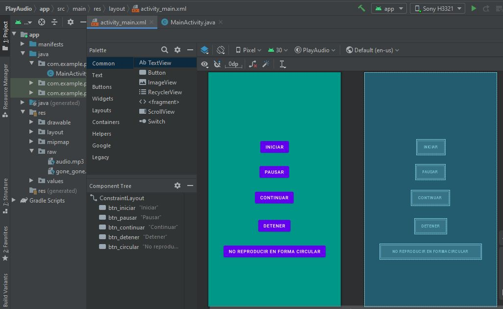
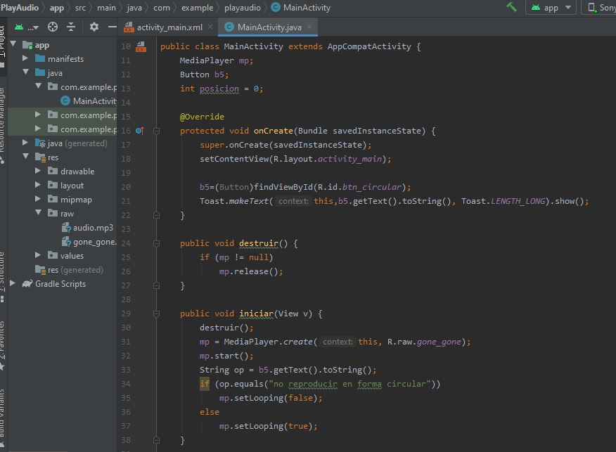
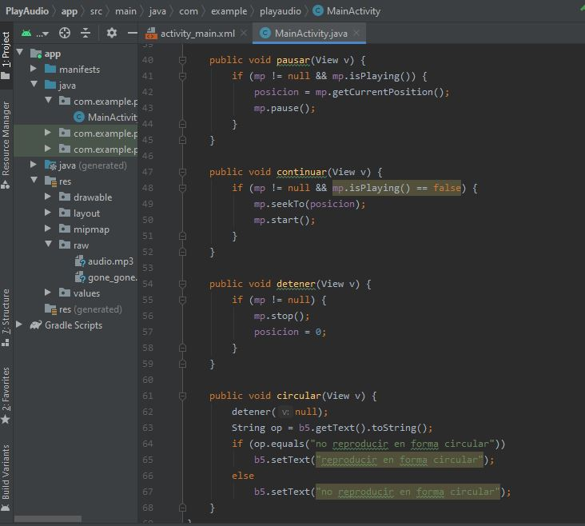
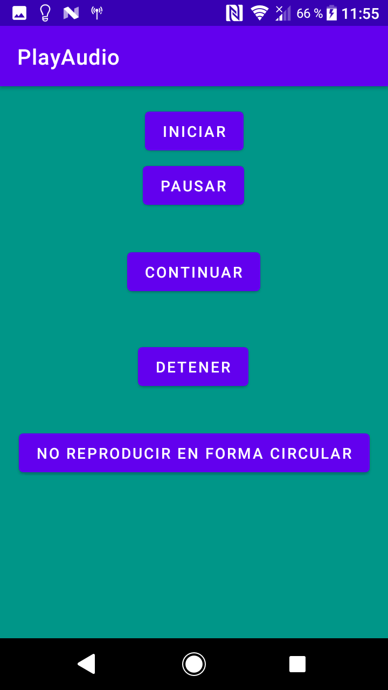
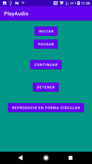

# Ejercicio 3
## Reproducir, pausar y detener de archivo de audio
### Interfaz Principal

### Código principal

### Código funciones

### Aplicación

### Reproducción en forma circular desactivado

