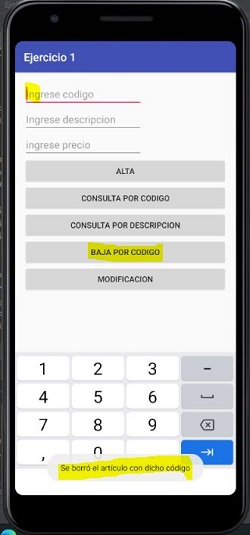

# Ejercicio 1
## Almacenamiento en una base de datos SQLite
### Interfaz Principal

### Interfaz Alta

### Interfaz de Consulta por Código

### Interfaz de Consulta por Descripción

### Interfaz Baja

### Interfaz Modificación

